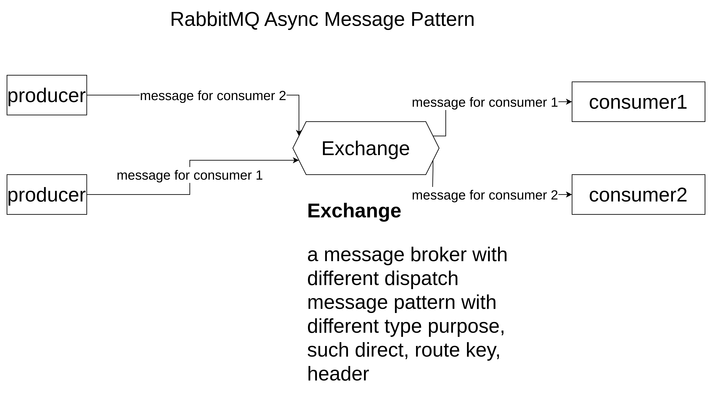

# golang-rabbitmq-sample

This is a example for use rabbitmq with golang

## asynchronize message pattern



## use package 

https://github.com/rabbitmq/amqp091-go

## install

```shell
go get github.com/rabbitmq/amqp091-go
go get github.com/gin-gonic/gin
```

## producer logic

```golang
package main

import (
	"fmt"
	"log"
	"net/http"
	"os"

	"github.com/gin-gonic/gin"
	"github.com/leetcode-golang-classroom/golang-rabbitmq-sample/internal"
	amqp "github.com/rabbitmq/amqp091-go"
)

func main() {
	// connect to rabbitmq
	conn, err := amqp.Dial(internal.AppConfig.RABBITMQ_URL)
	if err != nil {
		log.Fatal(err)
	}
	defer conn.Close()
	// open a channel
	channel, err := conn.Channel()
	if err != nil {
		log.Fatal(err)
	}
	defer channel.Close()
	// declare queue
	_, err = channel.QueueDeclare(internal.AppConfig.QUEUE_NAME, true, false, false, false, nil)
	if err != nil {
		log.Fatal(err)
	}

	// create a web server with gin
	router := gin.Default()
	// add route for access request
	router.GET("/send", func(ctx *gin.Context) {
		msg := ctx.Query("msg")
		if msg == "" {
			ctx.JSON(http.StatusBadRequest, gin.H{"error": "Message is required"})
			return
		}
		// create a message to publish
		message := amqp.Publishing{
			ContentType: "text/plain",
			Body:        []byte(msg),
		}
		// publish message to queue
		err = channel.Publish("", internal.AppConfig.QUEUE_NAME, false, false, message)
		if err != nil {
			// log.Printf("failed to publish message: %w", err)
			fmt.Fprintf(os.Stderr, "failed to publish message: %v", err)
			ctx.JSON(http.StatusInternalServerError, gin.H{"error": "Failed to publish message"})
			return
		}
		ctx.JSON(http.StatusOK, gin.H{"message": msg, "status": "success"})
	})

	log.Fatal(router.Run(fmt.Sprintf(":%v", internal.AppConfig.PORT)))
}
```

## consumer logic
```golang
package main

import (
	"log"
	"os"
	"os/signal"
	"syscall"

	"github.com/leetcode-golang-classroom/golang-rabbitmq-sample/internal"
	amqp "github.com/rabbitmq/amqp091-go"
)

func main() {
	// connect to rabbitmq
	conn, err := amqp.Dial(internal.AppConfig.RABBITMQ_URL)
	if err != nil {
		log.Fatal(err)
	}
	defer conn.Close()
	// open a channel
	channel, err := conn.Channel()
	if err != nil {
		log.Fatal(err)
	}
	defer channel.Close()
	// subscribe the message to the queue
	messages, err := channel.Consume(internal.AppConfig.QUEUE_NAME, "", true, false, false, false, nil)
	if err != nil {
		log.Fatal(err)
	}
	signChan := make(chan os.Signal, 1)
	signal.Notify(signChan, syscall.SIGINT, syscall.SIGTERM)

	for {
		select {
		case message := <-messages:
			log.Printf("Message: %s\n", message.Body)
		case <-signChan:
			log.Println("Interrupt detected")
			os.Exit(0)
		}
	}
}
```